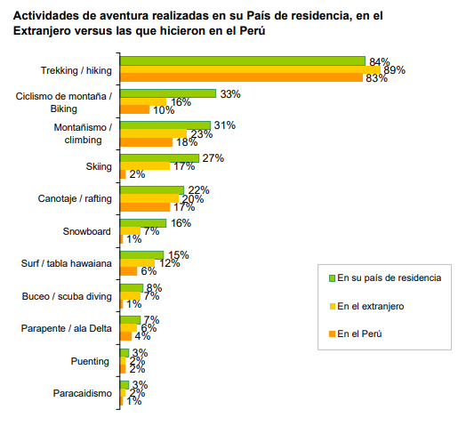

# VIVE EXTREME APP

### **OBJETIVO**
Aplicación movil, orientada a los amantes de las actividades outdoor, permite trackear rutas y brindar información relevante de los diferentes destinos turísticos del Perú.

### **REQUERIMIENTOS**
   [Ver aquí](https://drive.google.com/file/d/1GNGlul4f9GDqBRn-mbMdxyo7wlBGFj35/view?usp=sharing)
   
   A TENER EN CUENTA: El reto asignado fue tanto para equipos Front-end y UX. Por consiguiente, en este caso el entregable final de este proyecto es un prototipo (high-fidelity).

### **REFERENCIAS**
 [Wikiloc](https://es.wikiloc.com/)

## Tabla de contenido

1.- [RESEARCH](#research)

2.- [SÍNTESIS](#sintesis)

3.- [IDEACIÓN](#ideación)

4.- [FLUJO DE LA APLICACIÓN](#flujo-de-la-aplicación)

5.- [DEMO](#demo)

## 1.RESEARCH
#### 1.1 Research Cualitativo
##### Entrevistas a Usuarios

Entrevistamos a usuarios interesados en realizar actividades de aventura, con el fin de conocer más sobre todo lo que implica realizar rutas outdoor en nuestro país.

[Guía de Entrevista](https://docs.google.com/document/d/1d3CMoJnxAI2V1TIg_0NI9_p1XIugrvIn4AILy7kCLC0/edit?usp=sharing)

#### 1.2 Research Cuántitativo

Buscamos indicadores y datos registrados en la web, que nos pudieran brindar una mejor perspectiva de nuestro público objetivo.

##### DATOS RELEVANTES
 - El Perú recibe turistas experimentados en turismo de aventura, especialmente en **trekking (89%)**,
lo cual lo hace exigente ante cualquier oferta. Es más, un segmento interesante de ellos (30%) ha
viajado en anteriores oportunidades a nuestro país para realizar turismo de aventura.

Fuente: [Promperú](https://www.promperu.gob.pe/TurismoIN/Uploads/temp/Uploads_mercados_y_segmentos_segmentos_1005_Publicacion-Perfil-del-Turista-de-Aventura.pdf)
##### Benchmark 

## 2.SÍNTESIS
## 3.IDEACIÓN
## 4.FLUJO DE LA APLICACIÓN
## 5.DEMO
Prototipo Versión 01: [Ver](https://marvelapp.com/5d52846)

Prototipo Versión Final: [Ver](https://marvelapp.com/6af43i3/screen/42130117)